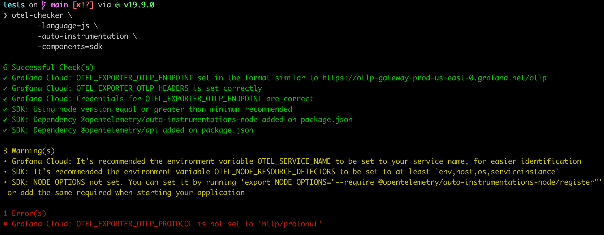
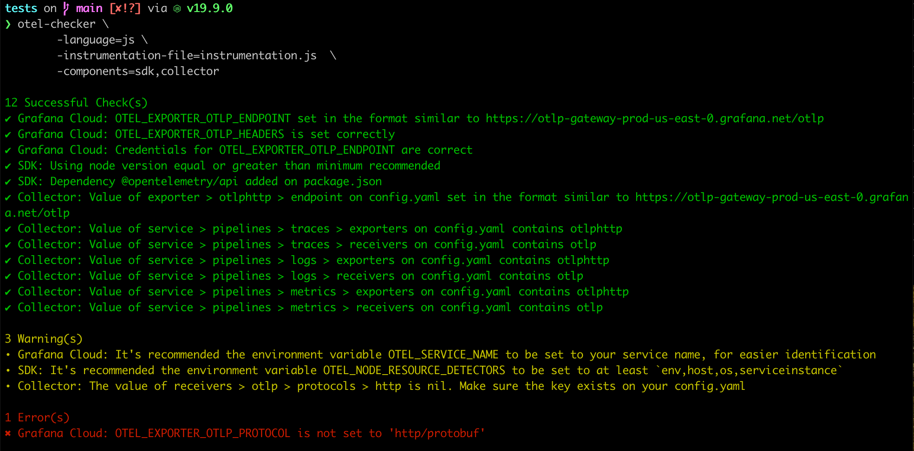

# OTel Me If It's Right

Checker if the implementation of OpenTelemetry instrumentation is correct.

## Usage

Requirement: Golang

### Installation
1. Install the `otel-checker` binary
```
go install github.com/grafana/otel-checker@latest
```
2. You can confirm it was installed with:
```
❯ ls $GOPATH/bin
otel-checker 
```

### Flags

The available flags:
```
❯ otel-checker -h
Usage of otel-checker:
  -auto-instrumentation
    	Provide if your application is using auto instrumentation
  -collector-config-path string
    	Path to collector's config.yaml file. Required if using Collector and the config file is not in the same location as the otel-checker is being executed from. E.g. "-collector-config-path=src/inst/"
  -components string
    	Instrumentation components to test, separated by ',' (required). Possible values: sdk, collector, beyla, alloy
  -instrumentation-file string
    	Name (including path) to instrumentation file. Required if not using auto-instrumentation. E.g."-instrumentation-file=src/inst/instrumentation.js"
  -language string
    	Language used for instrumentation (required). Possible values: dotnet, go, java, js, python
  -package-json-path string
    	Path to package.json file. Required if instrumentation is in JavaScript and the file is not in the same location as the otel-checker is being executed from. E.g. "-package-json-path=src/inst/"
```

### Checks

#### Grafana Cloud
- Endpoints
- Authentication
- Service name
- Exporter protocol

#### SDK

##### JavaScript
- Node version
- Required dependencies on package.json
- Required environment variables
- Resource detectors
- Dependencies compatible with Grafana Cloud
- Usage of Console Exporter

#### Python
TBD

#### .NET
TBD

#### Java
TBD

#### Go
TBD

#### Ruby
TBD


#### Collector
- Config receivers and exporters

#### Beyla
- Environment variables

#### Alloy
TBD

### Examples

Application with auto-instrumentation


Application with custom instrumentation using SDKs and Collector


## Development

Requirement: Golang

### Running locally

1. Find your Go path:
```
❯ go env GOPATH
/Users/maryliag/go
```
2. Clone this repo in the go path folder, so you will have:
```
/Users/maryliag/go/src/otel-checker
```
3. Run 
```
go run main.go
```

### Create binary and run from different directory

1. Build binary
```
go build
```
2. Install
```
go install
```
3. You can confirm it was installed with:
```
❯ ls $GOPATH/bin
otel-checker 
```
4. Use from any other directory
```
otel-checker \
	-language=js \
	-auto-instrumentation \
	-components=sdk
```